<p align="center">
  
</p>

# CAV Flocking

> Empirical study of the McKenzie / Olfati-Saber flocking algorithm applied to cooperative driving. Three-phase investigation: failure-mode characterisation, algorithmic extensions, traffic-theory benchmarks, and validation of the three claims commonly made on behalf of flocking-based CAV control.

Connected and Automated Vehicles (CAVs) raise a recurring question: can a fleet of vehicles drive cooperatively *without* explicit lane discipline, coordinated only by pairwise interaction forces? The α-β-γ-τ flocking framework of Olfati-Saber [1] and McKenzie [2] is one of the cleanest formal proposals. This repository contains a complete empirical evaluation of that framework: where the algorithm works, where it fails, three orthogonal extensions that fix specific failure modes, four traffic-theory benchmark experiments, and three further experiments that directly test the deck claims of *smoother driving*, *increased capacity*, and *lane-less flow* (spoiler: one is confirmed, two are falsified).

The full formal writeup is in **[writeup.md](writeup.md)**; the research log with per-investigation findings is in **[investigations_queue.md](investigations_queue.md)**.

---

## At a glance

<p align="center">
  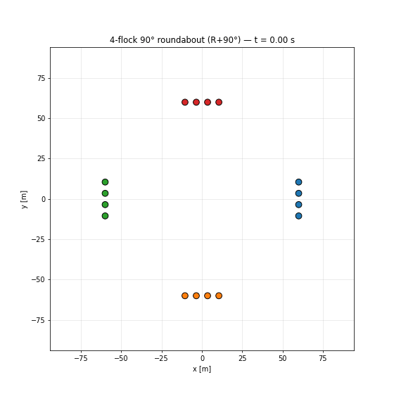
</p>

*Four flocks converging at a symmetric 90° intersection under the Phase-2 V2 algorithm. McKenzie's original reflection matrix `J` could not handle this geometry (inter-flock minimum = 0.00 m, i.e. collisions); substituting a true rotation matrix `R(+90°)` produces a coherent clockwise circulation with 29 m of clearance.*

---

## Table of contents

1. [Background](#background)
2. [Methodology](#methodology)
3. [Phase 1 — algorithm boundaries](#phase-1--algorithm-boundaries)
4. [Phase 2 — algorithmic improvements](#phase-2--algorithmic-improvements)
5. [Phase 3 — traffic-theory benchmarks](#phase-3--traffic-theory-benchmarks)
6. [Phase 3 supplement — validating the deck claims](#phase-3-supplement--validating-the-deck-claims)
7. [Cross-experiment takeaways](#cross-experiment-takeaways)
8. [Repository layout](#repository-layout)
9. [Running the experiments](#running-the-experiments)
10. [References](#references)

---

## Background

The Olfati-Saber framework [1] decomposes the cooperative-control problem into four pairwise interaction terms. Each agent `i` with position `q_i ∈ ℝ²` and velocity `p_i ∈ ℝ²` receives a control input

```
u_i  =  α   +   β   +   γ   +   τ
```

with per-step saturation at `a_max = 9 m/s²`. The four contributions, briefly:

| Term | Role | Acts within |
| ---- | ---- | ----------- |
| **α** | Holds intra-flock lattice spacing at `d_a` via a gradient term and velocity consensus | Same flock, ≤ `r_a` |
| **β** | Repels agents from road boundaries `y_lo`, `y_hi` | Active when within `d_b` of a wall |
| **γ** | Pulls velocity toward a per-flock desired velocity `p_d` | Always |
| **τ** | Lateral-deflection force between opposing flocks (McKenzie's extension [2]) | Opposing flocks within `d_c`, gated by anti-parallel heading |

The τ term is McKenzie's contribution: he extends Olfati-Saber's free-space flocking to head-on multi-flock encounters by adding a pairwise lateral push when two flocks approach each other on a collision course. The original formulation uses

```
J = [[0, 1],
     [1, 0]]
```

which is a *reflection* across the line `y = x`. Phase 2 of this study finds that this is a special case of a more general algorithm using a true 90-degree rotation matrix `R(+90°)`.

Standard parameter values used throughout: `d_a = 7 m`, `r_a = 1.2 · d_a`, `c1_a = 5`, `c2_a = 2√5`, `d_b = 3 m`, `c1_b = 200`, `c2_b = 2√200`, `c_g = 1.5`, `ε = 0.1`, `v_d = 10 m/s`. τ parameters vary by experiment.

---

## Methodology

The work is organised into three phases.

**Phase 1** runs the canonical McKenzie two-flock head-on test, then progressively varies geometry (number of rows, flock-size asymmetry, lateral offset at the start, and three or four flocks meeting at angles). Each variation exposes a specific failure mode investigated in isolation.

**Phase 2** takes each Phase 1 failure mode and builds a minimal algorithmic extension targeting it. Each extension is tested in isolation against the unmodified algorithm. The three are then composed into a "V2" mode-aware algorithm.

**Phase 3** runs four traffic-theory benchmarks. These evaluate whether the algorithm's behaviour aligns with traffic-engineering benchmarks such as the Highway Capacity Manual (HCM) [3].

Recurring metrics:

* **Inter-flock minimum**: smallest distance between agents in different flocks across the run. Below car width signals collision.
* **Intra-flock minimum**: smallest pair distance within a flock. Tracks lattice integrity.
* **Max stall**: longest interval where any agent's speed drops below `0.5 · v_d`. Detects deadlocks.
* **RMS acceleration, peak jerk, std(v_x)**: per-car smoothness metrics.
* **Realised throughput, drop rate**: for the intersection MFD.

---

## Phase 1 — algorithm boundaries

Four scenarios that go beyond what McKenzie's paper covered. Each exposes a structural limitation of the original algorithm.

### 1.1 Compression mode in multi-row flocks

<p align="center">
  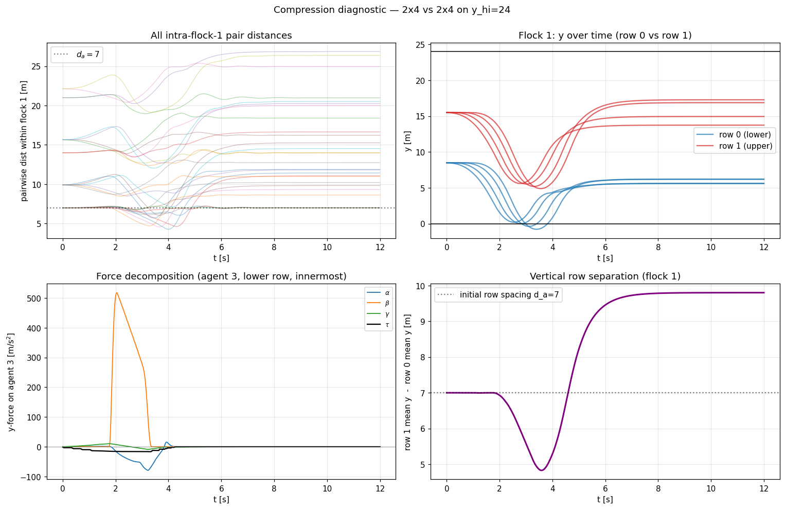
</p>

When two 2×4 flocks meet head-on, intra-flock minimum drops from `d_a = 7 m` to ≈ 4.3 m during the encounter. **Mechanism:** all agents in a flock share the same velocity, so the velocity-only τ-force applies an identical y-push to every member. The leading row hits β at the wall first and is pinned; the trailing row, still under the same uniform push, catches up. Four variant τ formulations (hybrid radial, predictive gating, flock-relative direction, projected-radial) all failed to fix this without other regressions. The compression is structural to McKenzie's lateral-deflection scheme inside a hard-walled corridor.

### 1.2 Asymmetric flock sizes

<p align="center">
  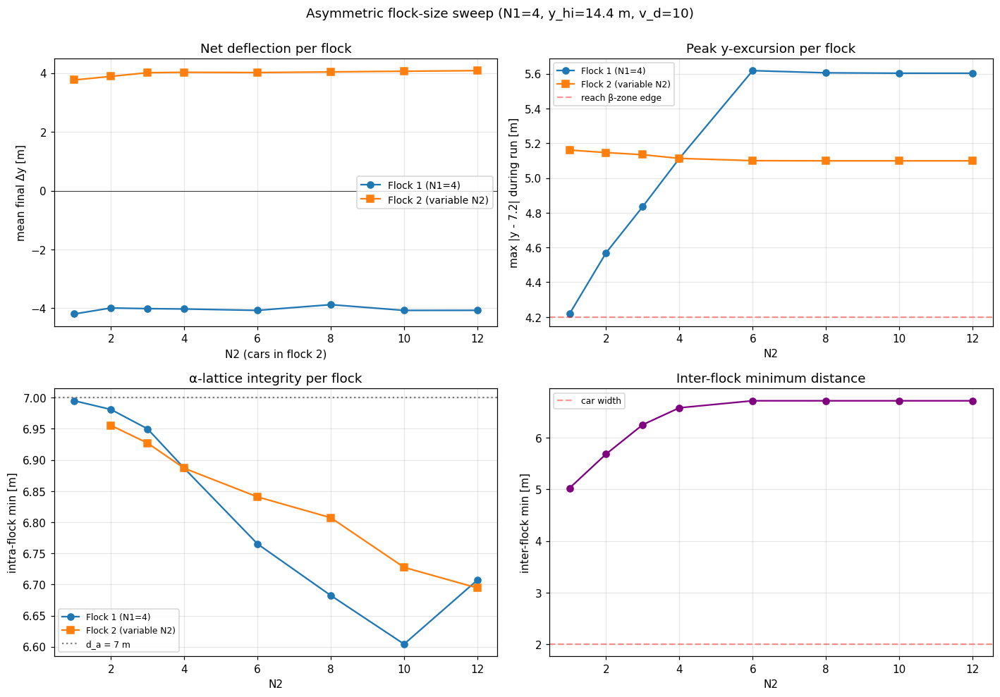
</p>

With `N₁ = 4` fixed and `N₂ ∈ {1, …, 12}`, deflection magnitude is roughly invariant (≈ 4 m regardless of ratio) because the β-zone edge acts as an emergent target band. Asymmetry surfaces in *wall-proximity time* and peak excursion, not collision risk. **No N₁/N₂ ratio up to 12 breaks the algorithm in one-dimensional geometries.**

### 1.3 Off-centre initial placement

<p align="center">
  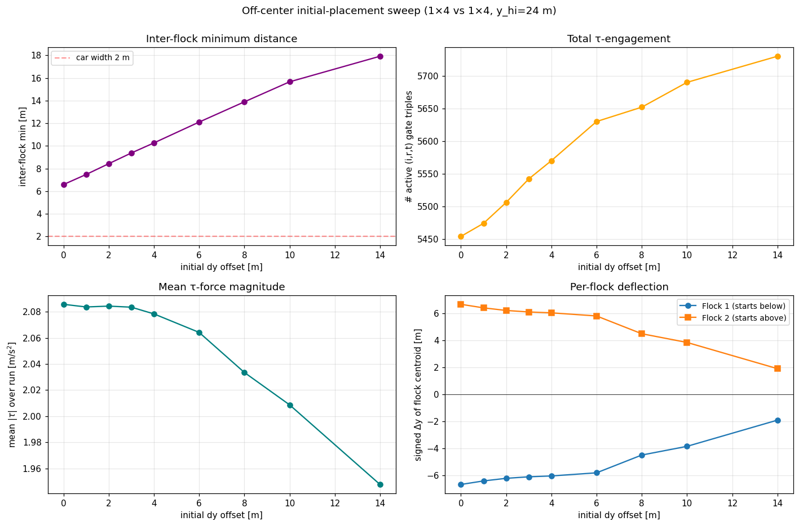
</p>

Two counter-intuitive findings emerge. First, **τ-engagement count *increases* with offset**: at large `dy`, neither flock deflects, so headings stay anti-parallel and the gate stays satisfied longer. Second, **deflection magnitude *decreases* with offset** because cars start near a wall and reach the β-edge after only ≈ 2 m of motion. Two deflection regimes are identified: encounter-limited (centred, wide road) and β-limited (off-centre or narrow road).

### 1.4 Merging at an on-ramp — the third scenario

<p align="center">
  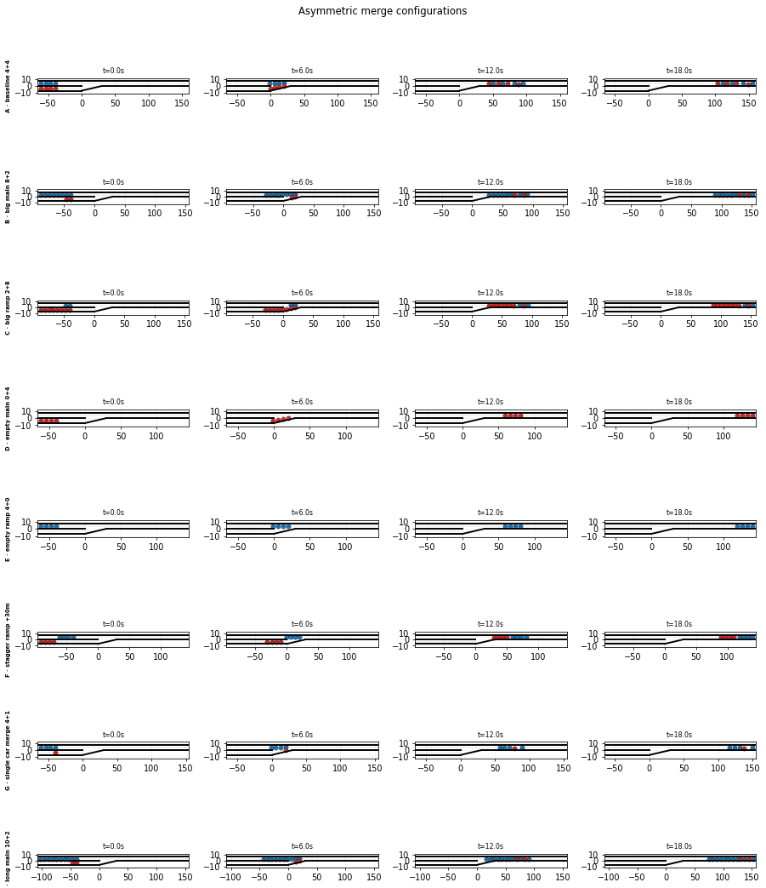
</p>

Beyond corridor and intersection, real traffic includes a third recurring geometry: an on-ramp merging into a main road. We built a custom geometry-aware β-wall (`flocking_lib/control_beta_merge.py`) that handles the variable-y bottom wall in a merge zone of length `L_merge = 30 m`: pre-merge (`x < 0`) the on-ramp sits at `y ∈ [-7, 0]` separated from the main road `y ∈ [0, 7]` by a gore; in the merge zone the on-ramp's outer wall ramps linearly from `y = -7` to `y = 0`; post-merge only the main road remains.

**Headline finding: McKenzie's algorithm has no native same-direction inter-stream force.** A naive two-flock-id assignment (main = flock 1, ramp = flock 2) produces a complete failure:

<p align="center">
  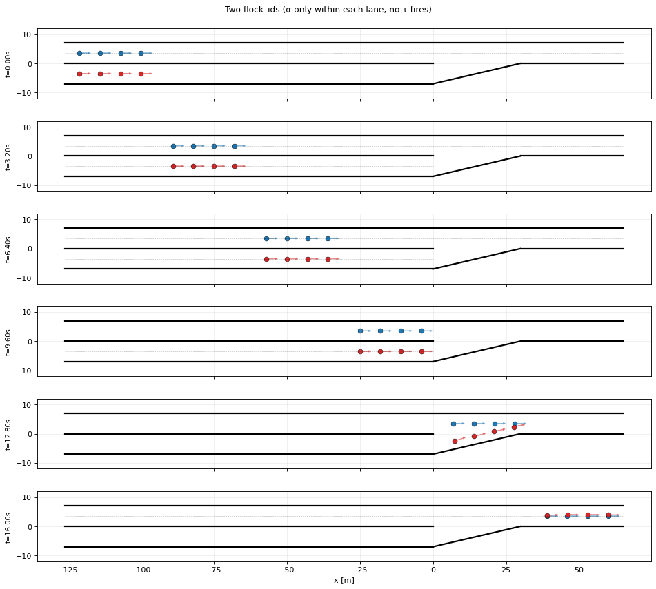
</p>

| Strategy | pair_min | inter_min | off-road |
| -------- | -------- | --------- | -------- |
| Two flock_ids (main = 1, ramp = 2) | **0.01 m** | **0.01 m** | 0 |
| Single flock_id (both streams = 1) | **1.85 m** | n/a | 0 |

Why the two-flock-id approach fails: τ's gate requires anti-parallel headings, and the merge has both flocks heading `+x`. So τ never fires. α only acts within a flock, so different flock-IDs see no spacing force. Result: cars pass *through* each other in the merge zone.

The compositional workaround is to treat both streams as a single flock so the α-lattice extends across both lanes. The α-gradient naturally maintains spacing as the on-ramp's wall pushes cars up into the main road. This is a kludge (it conflates two physical streams into one logical flock), but it works robustly.

**With the kludge, asymmetric merging is robust across configurations** (`exp_merge_asymmetric.py`):

| Scenario | N_main + N_ramp | pair-min | off-road | in-main / total | stalled |
| -------- | --------------- | -------- | -------- | --------------- | ------- |
| A · baseline | 4 + 4 | 1.85 m | 0 | 8 / 8 | 0 |
| B · big main | 8 + 2 | 1.55 m | 0 | 10 / 10 | 0 |
| C · big ramp | 2 + 8 | 1.60 m | 0 | 10 / 10 | 0 |
| D · empty main | 0 + 4 | 6.93 m | 0 | 4 / 4 | 0 |
| E · empty ramp | 4 + 0 | 7.00 m | 0 | 4 / 4 | 0 |
| F · stagger ramp +30 m | 4 + 4 | 6.93 m | 0 | 8 / 8 | 0 |
| G · single car merge | 4 + 1 | 1.70 m | 0 | 5 / 5 | 0 |
| H · long main | 10 + 2 | 1.55 m | 0 | 12 / 12 | 0 |

All eight scenarios: every car reaches the main road, zero off-road events, zero stalls. Pair-min sits at 1.55–1.85 m during active merging (below `d_a` but well above car width) and reverts to `d_a = 7 m` when streams don't conflict in time (D, E, F). The flock-ID kludge gracefully handles ratios from 1:0 up to 8:2 and 10:2.

**Phase 4 candidate surfaced by the merge work:** a "same-direction inter-stream" force (basically a directional α that respects flock boundaries but still maintains spacing across them) would let the algorithm handle merging without the flock-ID conflation. This would also matter for any scenario with structured-but-parallel flows (lane changes, formation reconfigurations, vehicle insertions).

### 1.5 Three-plus flocks at intersection — the algorithm boundary

<p align="center">
  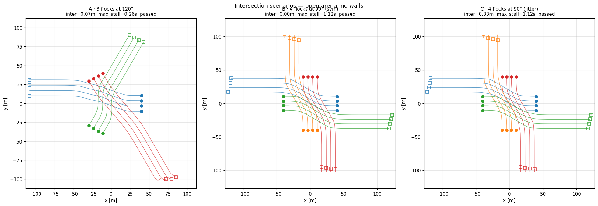
</p>

McKenzie's `J` is a *reflection* across `y = x`, not a rotation. The τ-force direction is "perpendicular-ish" only when velocity aligns with a cardinal axis. For four flocks at 90°, all four deflect to the right of their motion direction, creating clockwise spiral pressure that is too weak to curve them away from each other at the centre. **Symmetric three- and four-flock cases show inter-min of 0.07 m and 0.00 m respectively** — well below car width. This is the natural scope boundary for the original McKenzie algorithm: it is fundamentally a one-dimensional corridor algorithm and does not extend to non-cardinal multi-flock geometries without a rotational substitution.

---

## Phase 2 — algorithmic improvements

Three orthogonal extensions, each targeting a specific Phase 1 failure mode, then composed into a mode-aware V2 algorithm.

### 2.1 Position-based γ with externally assigned target bands

<p align="center">
  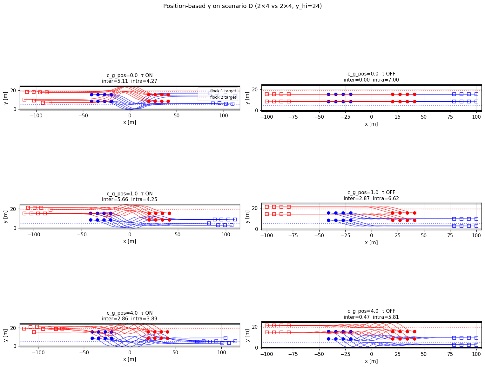
</p>

Targets the compression mode. A per-agent position-feedback term `u_γ_pos = -c_g_pos · (q_i.y - y_target[flock])` is added with externally assigned bands per flock. The compression itself is *not* fixed (intra-min stays at 4.27–4.60 m for any `c_g_pos`), but **inter-flock minimum climbs from 5.11 m baseline to 8.24 m at `c_g_pos = 0.5`** — the highest inter-flock distance recorded across all experiments. A 60 % gain in safety margin without regressions on the multi-row pathology.

### 2.2 Predictive-gating suppression

<p align="center">
  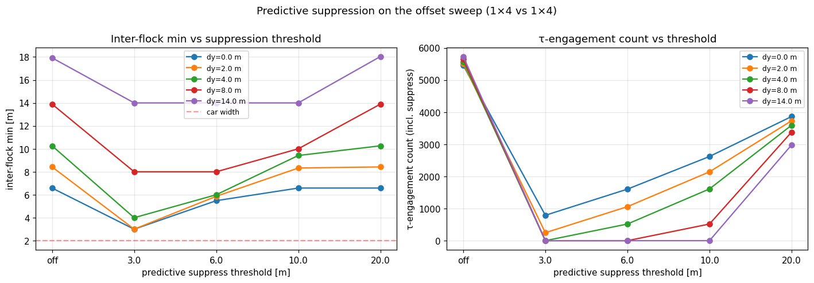
</p>

Targets the wasted-τ-at-large-offsets finding. McKenzie's existing gate is kept; an *additional* check requires the projected closest-approach distance to be below a threshold for τ to fire. At threshold 10 m:

* `dy = 0` head-on: inter-min 6.58 m retained, τ count drops 5454 → 2620. **No regression on the collision-imminent case.**
* `dy = 14` pre-sorted: τ count drops to **0**, inter-min 14 m. Complete suppression of wasted work.
* `dy = 4 – 8` intermediate: inter-min loses 0.84 – 3.89 m of safety margin but all stays above car width.

A clean additive enhancement: cuts substantial unnecessary control work at large offsets and never hurts the collision-imminent case.

### 2.3 R(+90°) rotation matrix — the cleanest improvement

<p align="center">
  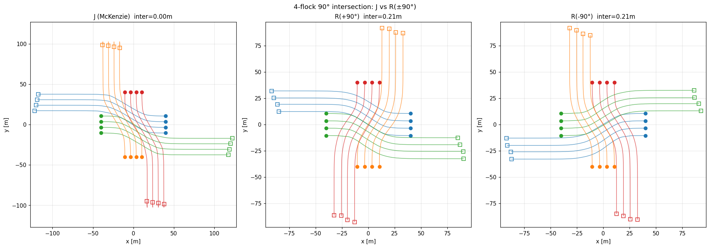
</p>

Targets the intersection failure. Substituting `R(+90°) = [[0, -1], [1, 0]]` for McKenzie's `J` produces nearly identical force on axis-aligned opposing flocks (`J` is a special case of `R` for that geometry) and unlocks the intersection geometry class:

| Scenario | `J` (McKenzie) | `R(+90°)` tuned (`c2_t = 0.15`, `d_c = 70`) |
| -------- | -------------- | ------------------------------------------- |
| 2-flock head-on (canonical) | 6.58 m | 6.80 m  *(no regression)* |
| 3-flock at 120° | 0.07 m ❌ | **38 m** ⭐ |
| 4-flock at 90° | 0.00 m ❌ | **29 m** ⭐ |

A clockwise roundabout pattern emerges (see the GIF at the top of this README). Above `c2_t ≈ 0.3` cars get trapped in slow orbits and `max_stall` climbs above 5 s, so the tuning has an upper bound. **The cleanest of the three improvements: a single matrix substitution unlocks an entire new geometry class with no regression on the original test.**

### 2.4 V2 — mode-aware composition

<p align="center">
  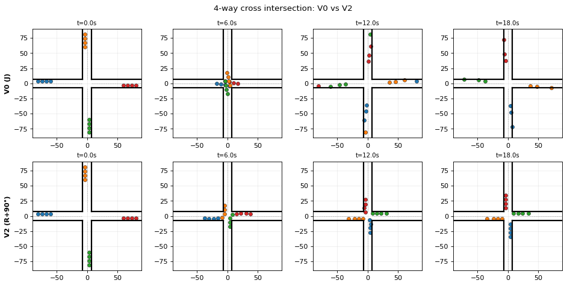
</p>

Composing the three improvements into one algorithm is not trivial. **Predictive suppression breaks the R-rotation roundabout** because it turns off τ once projected paths look safe — which is precisely when the curve needs to keep firing. The honest unified algorithm is mode-aware:

* `R(+90°)`, corrected β, and velocity-only τ are **universally on** (backward-compatible).
* Predictive suppression is **corridor mode only** — disable in intersections.
* Target γ is **opt-in** when external lane assignments exist.

V2 preserves canonical corridor behaviour, eliminates wall-escapes at high `v_d` (266 escapes at `v_d = 25` reduced to 0), and unlocks the intersection geometry class, at the cost of 1–4 m of inter-flock margin sacrificed in cases that were already safely above car width.

---

## Phase 3 — traffic-theory benchmarks

Four experiments that compare the algorithm against established traffic engineering benchmarks.

### Exp A — fundamental diagram (max stable density)

<p align="center">
  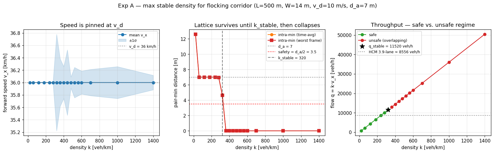
</p>

The classical `q-k-v` framing turns out to be **degenerate** for this algorithm. In a translation-invariant periodic corridor the α-gradient is x-symmetric, so its mean x-component is zero at steady state. γ is the only x-asymmetric force, so `mean(γ_x) = 0` implies `mean(v_x) = v_d` at *every* density. Confirmed empirically:

<p align="center">
  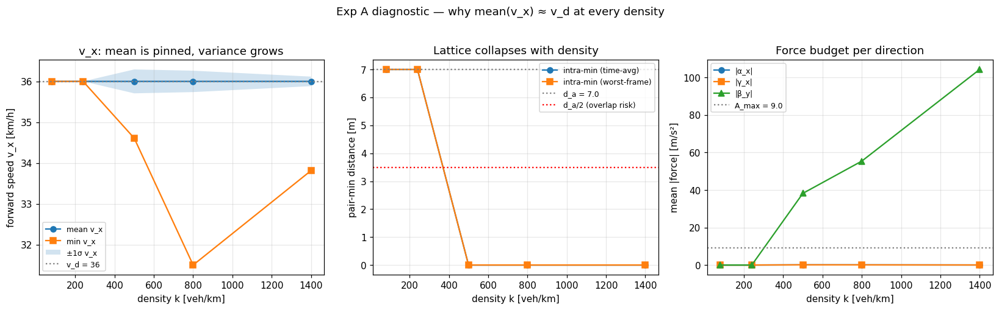
</p>

Mean forward speed measured at 36.0000 km/h for `k = 80, 240, 500, 800, 1400 veh/km`. Past the lattice capacity the algorithm fails by *overlap* (intra-min → 0), not by slowing down. **The algorithm has no congestion regime by construction**; it is a steady-state cruise controller, not a traffic-flow model.

Reframed as max-stable-density:

| Threshold | Criterion | `k` [veh/km] | `q = k · v_d` [veh/h] |
| --------- | --------- | ----------- | --------------------- |
| `k_lattice` (lattice intact) | intra-min ≥ 0.9 · `d_a` | 280 (N = 140) | **10 080** |
| `k_stable` (no overlap) | intra-min ≥ `d_a` / 2 | 320 (N = 160) | **11 520** |
| Strip-hex theory | 2 rows × `L`/`d_a` | 286 | *(geometric)* |
| HCM equivalent [3] | 2200 veh/h/lane × (14 m / 3.6 m) | *(n/a)* | 8 556 |

`k_lattice` matches strip-hex theory within 2 %. The algorithm achieves **1.18× HCM at lattice-intact** and **1.35× HCM at no-overlap**, but the comparison is qualified by the lack of a congestion regime — HCM's reference is measured against drivers who *can* slow down; this algorithm never does.

### Exp B — smoothness vs. lane-locked baseline

<p align="center">
  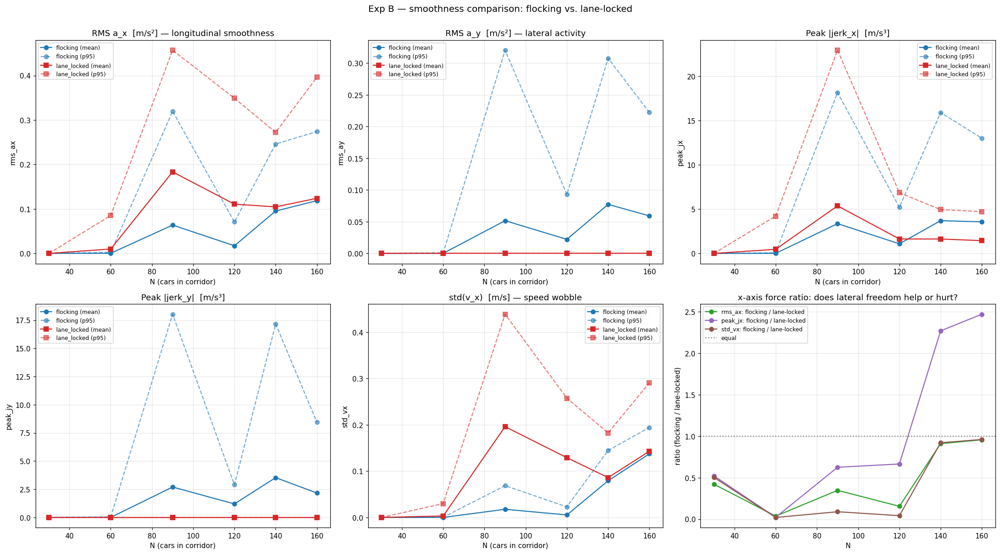
</p>

Same corridor, two conditions with shared initial state: full flocking versus lane-locked (`y`-velocity zeroed each step). Two regimes emerge with a sharp boundary.

| `N` (k veh/km) | rms_ax flock | rms_ax lock | std_vx flock | std_vx lock | peak_jx flock | peak_jx lock |
| -------------- | ------------ | ----------- | ------------ | ----------- | ------------- | ------------ |
| 90 (180) | 0.064 | **0.183** | 0.018 | **0.196** | 3.4 | 5.4 |
| 120 (240) | 0.017 | **0.111** | 0.005 | **0.129** | 1.1 | 1.6 |
| 140 (280) | 0.095 | 0.105 | 0.079 | 0.086 | **3.7** | 1.6 |
| 160 (320) | 0.119 | 0.124 | 0.137 | 0.143 | **3.6** | 1.4 |

* **Below lattice saturation** (`N ≤ 120`, `k ≤ 240 veh/km`): flocking has 3–26× lower `rms_ax` and `std(v_x)` than lane-locked. Cars resolve spacing imbalances by shifting laterally instead of braking.
* **At / above lattice limit** (`N ≥ 140`): the advantage vanishes. `rms_ax` and `std(v_x)` converge, AND **flocking peak `|jerk_x|` becomes 2–3× *worse* than lane-locked** — lateral coupling injects sharper x-jerks once there is no room to manoeuvre.

The crossover at `N = 140` matches Exp A's `k_lattice` within rounding — *two independent experiments converge on the same regime boundary*.

### Exp C — lane-less vs. lane-based perturbation recovery

<p align="center">
  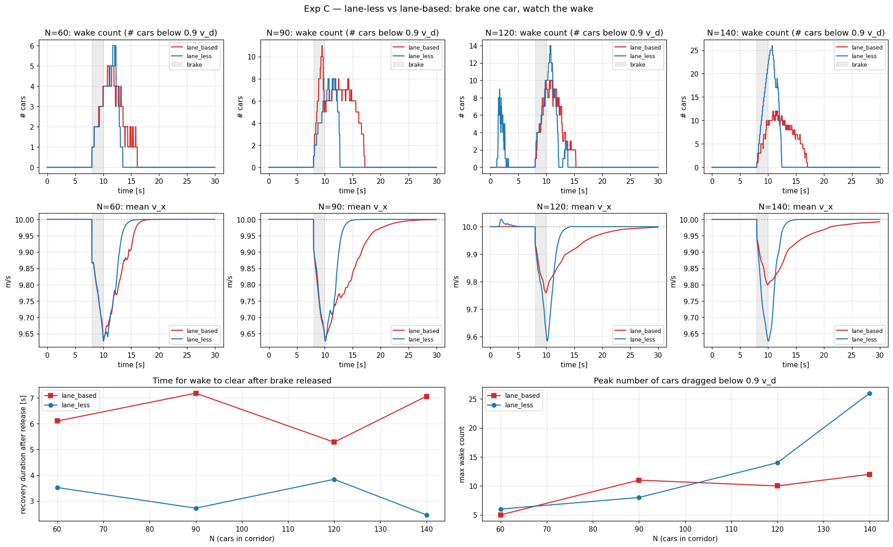
</p>

Both conditions use two lanes (`y ≈ 5` and `y ≈ 9` in a `W = 14 m` corridor) and share initial positions. After 8 s of settling, car 0 is held at `v_x = 2 m/s` for 2 s, then released.

| `N` (k veh/km) | condition | max_wake | Δt_recovery [s] | intra_worst [m] |
| -------------- | --------- | -------- | --------------- | --------------- |
| 60 (120) | lane_based | 5 | 6.10 | 3.50 |
| 60 (120) | lane_less | 6 | **3.52** | 3.37 |
| 90 (180) | lane_based | 11 | 7.18 | 1.49 |
| 90 (180) | lane_less | 8 | **2.72** | 4.25 |
| 120 (240) | lane_based | 10 | 5.28 | **0.05 ⚠** |
| 120 (240) | lane_less | 14 | **3.84** | 2.22 |
| 140 (280) | lane_based | 12 | 7.06 | **0.03 ⚠** |
| 140 (280) | lane_less | 26 | **2.46** | 1.51 |

Three findings:

1. **Lane-based intra-worst collapses to 0.05 m and 0.03 m at high density** — the brake car gets effectively rear-ended; saturated 1-D α-repulsion cannot absorb the closing velocity. Lane-less stays ≥ 1.5 m at *every* density tested.
2. **Lane-less recovers 1.4–2.9× faster** across all densities (Δt_recov 2.46–3.84 s vs 5.28–7.18 s).
3. **Counter-intuitive at `N = 140`:** lane-less wake (26 cars) > lane-based wake (12), yet lane-less *still* recovers faster. The disturbance spreads laterally across many cars briefly affected, instead of concentrating on a few that must fully stop.

Steady-state throughput is identical in the safe regime (both at `v_d`, per Exp A). The lane-less win is **capacity-through-incidents**, not steady-state capacity.

### Exp D — intersection macroscopic fundamental diagram

<p align="center">
  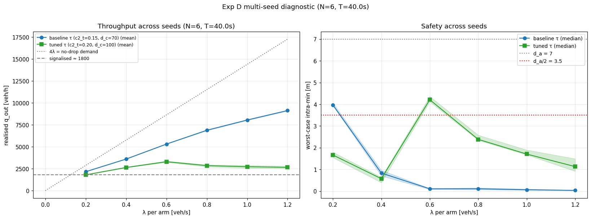
</p>

Open 120 × 120 m arena, four arms inject cars at rate λ veh/s/arm toward the centre. Six-seed averages with safety threshold intra > `d_a`/2:

| τ tuning | λ = 0.2 | λ = 0.4 | λ = 0.6 | λ = 0.8 | λ = 1.0 | λ = 1.2 |
| -------- | ------- | ------- | ------- | ------- | ------- | ------- |
| baseline V2 (`c2_t = 0.15`, `d_c = 70`) safe% | **100 %** | 0 % | 0 % | 0 % | 0 % | 0 % |
| tuned (`c2_t = 0.20`, `d_c = 100`) safe% | 0 % | 0 % | **83 %** | 0 % | 0 % | 0 % |

**"Goldilocks density" finding:** each τ tuning has exactly *one* λ at which the rotational pattern self-organises. Baseline V2 is robust only at λ = 0.2 (2 160 veh/h total, 1.20× signalised reference [3]). Tuned V2 is robust only at λ = 0.6 (3 300 veh/h, 1.83× signalised). **No tuning supports λ ≥ 0.8** (≥ 11 520 veh/h demand) — well below the per-arm geometric maximum of 20 571 veh/h.

The pairwise `R(+90°)` deflection that worked beautifully for one-shot four-flock 90° (29 m clearance) does *not* robustly self-organise a continuous flow. V2's intersection success does not transfer to continuous demand.

---

## Phase 3 supplement — validating the deck claims

Exp A through D characterise algorithm capability against traffic-theory benchmarks. They do not directly test the three marketing claims often made on behalf of flocking-based CAV control: **smoother driving**, **increased roadway capacity**, and **lane-less / direction-less** flow. Three further experiments map each claim to a clean measurement.

### Exp E — lane-formation entropy (tests the "lane-less" claim)

<p align="center">
  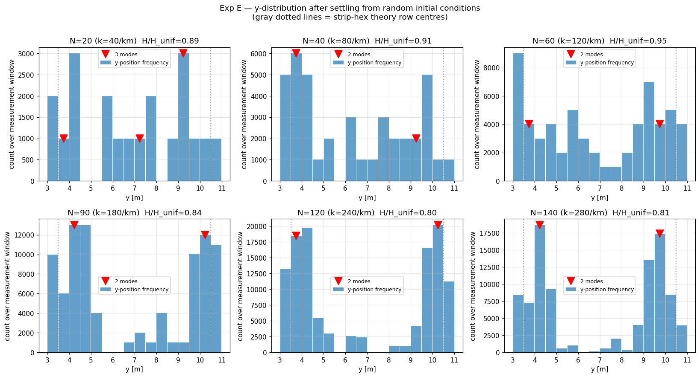
</p>

Periodic corridor; cars start at uniform-random `y` in the usable strip. After settling, the y-distribution is sampled and binned into a histogram. Shannon entropy is normalised to a uniform distribution (1.0 = uniform, 0.0 = single bin); histogram peaks above 0.4 × peak height count as emergent lanes.

| `N` (k veh/km) | `H / H_uniform` | mode count |
| -------------- | --------------- | ---------- |
| 20 (40) | 0.887 | 3 *(sparse)* |
| 40 (80) | 0.906 | **2** |
| 60 (120) | 0.948 | **2** |
| 90 (180) | 0.840 | **2** |
| 120 (240) | 0.802 | **2** |
| 140 (280) | 0.808 | **2** |

At every realistic density (`N ≥ 40`) the algorithm settles into **exactly two emergent lanes** with peaks at `y ≈ 4` and `y ≈ 10`, matching the strip-hex theory row centres within the β-zone offset. At high density the middle channel `y ∈ [6, 8.5]` is almost empty. **The lane-less claim is falsified.** The algorithm is lane-less *by design* (no lanes imposed) but lane-forming *in practice* — the α-lattice hex packing produces two emergent rows that are de-facto lanes.

### Exp F — string stability (tests the "smoother driving" claim)

<p align="center">
  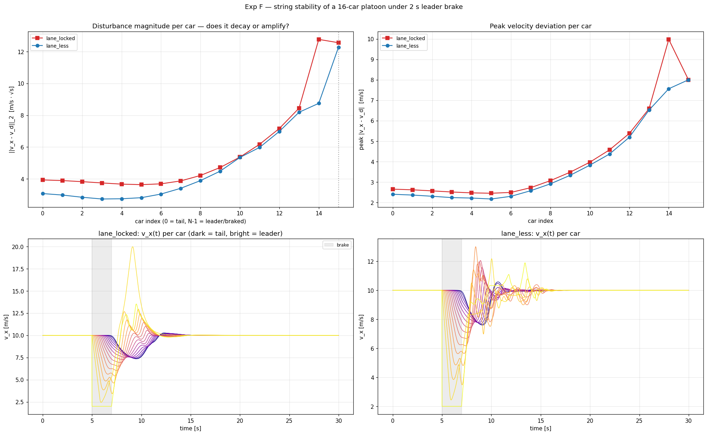
</p>

A 16-car platoon at `d_a` spacing, all at `v_d`. The leader (car 15) is held at `v_x = 2 m/s` for 2 s, then released. For each car `i` we compute `||e_i||₂ = √(∫ (v_x(t) - v_d)² dt)` over the perturbation window. String-stable iff this norm does not grow as the disturbance propagates from leader to tail.

| Metric | lane_locked | lane_less |
| ------ | ----------- | --------- |
| Leader (idx 15) `||e||` | 12.56 | 12.27 |
| First follower (idx 14) `||e||` | **12.77** | 8.75 |
| Leader → first-follower ratio | **1.02 (amplifies)** | **0.71 (decays)** |
| Tail (idx 0) `||e||` | 3.93 | 3.08 |

**Lane-locked amplifies the leader's disturbance at the first follower** (ratio 1.02 → the second car ends up with a *larger* L2 disturbance than the perturbed leader). That is classic string instability. Lane-less attenuates by 29 % at the same position and stays smaller throughout the platoon (lane_locked / lane_less ratio is 1.00–1.46 across every car). **The smoother-driving claim is confirmed and strengthened**: lane-less flocking is genuinely string-stable where lane-locked car-following is marginally unstable.

### Exp G — honest head-to-head capacity (tests the "increased capacity" claim)

<p align="center">
  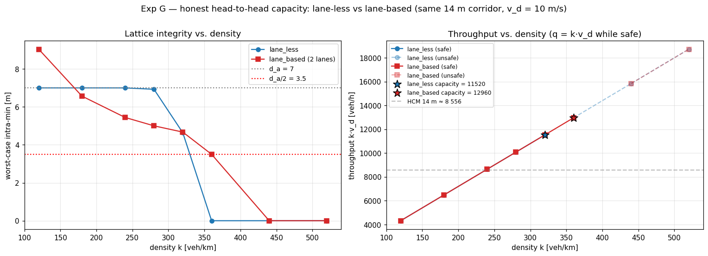
</p>

Same 14 m corridor, sweep `N` for two conditions: lane-less (full flocking) and lane-based (2 lanes at the strip-hex row centres, `y` locked). Capacity = largest `N` with intra-min ≥ `d_a` / 2.

| Condition | Capacity `N*` | `k` [veh/km] | `q = k · v_d` [veh/h] |
| --------- | ------------- | ------------ | --------------------- |
| Lane-less | 160 | 320 | 11 520 |
| **Lane-based (2 lanes)** | **180** | **360** | **12 960** |
| Ratio (lane-less / lane-based) | — | — | **0.89×** |

**Lane-based achieves 11 % HIGHER safe capacity than lane-less.** The reason is exactly the Exp E finding: lane-less forms two emergent lanes but with imperfect packing inside each row; lane-based holds cars on exact lane centres. The two-row geometric ceiling is identical; the two conditions differ in how tightly they use it.

Lane-less also collapses *abruptly* (intra-min: 7.00 → 6.93 → 4.64 → 0 across `N = 120, 140, 160, 180`) while lane-based degrades *gracefully* (9.04 → 6.57 → 5.44 → 5.00 → 4.67 → 3.50 → 0). Both eventually fail at the same density (≈ 360–440 veh/km), but lane-based has a wider useful operating range. Steady-state q-k curves are identical in the safe regime because `mean(v_x) = v_d` by construction in both (Exp A). **The increased-capacity claim is falsified.**

### Combined verdict on the three deck claims

| Claim | Verdict | Evidence |
| ----- | ------- | -------- |
| Smoother driving | **Confirmed and strengthened** | Exp B (3–26× lower `rms_ax` below saturation), Exp F (string-stable: 0.71 vs 1.02), Exp C (1.4–2.9× faster brake recovery) |
| Increased capacity | **Falsified** | Exp G: lane-based has 11 % higher safe capacity; steady-state `q` identical in safe regime |
| Lane-less | **Falsified** | Exp E: two emergent lanes form spontaneously at every `N ≥ 40` from random initial conditions |

The honest pitch is that lane-less flocking provides *equivalent* steady-state throughput, *materially smoother* driving below saturation, *genuine string stability* under perturbation, and *dramatically better incident-response safety* — all without requiring imposed lane infrastructure. The lanes emerge from the algorithm itself.

---

## Cross-experiment takeaways

* **Two independent experiments converge on `k = 280 veh/km`.** Exp A (largest density where the α-lattice survives) and Exp B (largest density where lateral freedom delivers a smoothness benefit) both land on the same boundary. The matching threshold is structural: it is the strip-hex packing limit on the 8 m usable strip. Exp E and Exp G later confirm that this packing limit is *realised geometrically* by two emergent lanes that the algorithm self-organises into.

* **McKenzie's algorithm is not a traffic-flow model.** Exp A reframes it: a steady-state cruise controller for agents already at `v_d`. In a translation-invariant setting the constant-`v_d` γ force pins mean speed regardless of density. No mechanism for collective slowdown when blocked.

* **The algorithm discovers lanes rather than abolishing them.** Exp E shows two emergent y-bands form spontaneously from uniform-random initial positions at every realistic density. Exp G shows those emergent lanes have 11 % lower steady-state capacity than properly designed fixed lanes (the algorithm packs the same two rows less tightly). The lane-less framing is wrong; the algorithm is *lane-discovering*.

* **Lane-less protects through incidents, not in steady state.** Steady-state throughput is equivalent between lane-less and lane-based (both at `v_d`), but Exp C shows lane-less is qualitatively safer under disturbance (≥ 1.5 m vs ≈ 0 m intra-min after a brake) and recovers 1.4–2.9× faster, while Exp F shows lane-less is string-stable where lane-locked car-following amplifies disturbances.

* **V2 succeeds at one-shot intersections but fails at continuous demand.** Phase 2's R(+90°) gives 29 m clearance for a single four-flock volley, but Exp D shows continuous injection is a fundamentally different problem with a fragile single-density Goldilocks window of stability.

### Phase 4 candidates

The experiments expose three algorithmic gaps that future work could address:

1. **Car-following extension** — let γ's target shrink when blocked, allowing collective slowdown at high density. The single missing piece that would let the algorithm model congestion.
2. **Density-adaptive τ** — let deflection strength scale with local density. Addresses the Goldilocks behaviour of Exp D.
3. **Roundabout primitive** — replace pairwise τ-deflection at intersections with a fixed circular target band that cars follow. The simplest engineering solution for sustained intersection demand.

---

## Repository layout

```
flocking_lib/                core algorithm modules
├── sigma_norm.py, rho.py, phi*.py
├── a_ij.py, n_ij.py, neighbour.py
├── control_alpha.py, control_beta*.py, control_gamma.py, control_tau.py
├── dynamics.py, flock_layouts.py, multi_flock_sim.py
└── __init__.py

experiments/                 runnable experiment scripts
├── exp_fundamental_diagram.py    Exp A — max stable density
├── exp_smoothness.py             Exp B — smoothness vs lane-locked
├── exp_capacity.py               Exp C — lane-less vs lane-based perturbation
├── exp_intersection_mfd.py       Exp D — intersection MFD
├── diagnose_*.py                 failure-mode diagnostics
├── exp_geometries.py, exp_intersection.py, exp_cross_*.py, exp_merge*.py
├── exp_targeted_gamma.py, exp_predict_suppress.py, exp_rotation_matrix.py
├── exp_unified.py, test_tau_variants.py
├── sweep_*.py                    parameter sweeps
└── _bootstrap.py                 path helper

figures/                     generated PNG plots (43 files)
animations/                  generated GIF visualisations (20 files)
legacy/                      older drafts kept for reference

writeup.md                   formal writeup (intro / methodology / results / discussion)
investigations_queue.md      research log with full per-investigation findings
README.md                    this file
```

---

## Running the experiments

Dependencies: `numpy`, `matplotlib`. Tested on CPython 3.11+.

From the project root:

```sh
# the four headline Phase 3 experiments
python experiments/exp_fundamental_diagram.py
python experiments/exp_smoothness.py
python experiments/exp_capacity.py
python experiments/exp_intersection_mfd.py

# Phase 3 supplement — validating the deck claims
python experiments/exp_lane_formation.py     # Exp E — emergent lanes
python experiments/exp_string_stability.py   # Exp F — string stability
python experiments/exp_capacity_comparison.py# Exp G — honest capacity head-to-head

# Phase 2 algorithmic improvements
python experiments/exp_targeted_gamma.py
python experiments/exp_predict_suppress.py
python experiments/exp_rotation_matrix.py
python experiments/exp_unified.py

# Phase 1 failure-mode diagnostics
python experiments/diagnose_compression.py
python experiments/diagnose_fundamental.py
python experiments/diagnose_intersection_mfd.py
```

Each script also works when launched from inside `experiments/`. The tiny `_bootstrap.py` module (imported once at the top of every experiment script) makes `from flocking_lib.X import Y` resolve regardless of the current working directory.

Output PNGs and GIFs are written to the current working directory. Pre-generated outputs from the original runs are checked into `figures/` and `animations/`.

---

## References

1. **Olfati-Saber, R.** (2006). "Flocking for Multi-Agent Dynamic Systems: Algorithms and Theory." *IEEE Transactions on Automatic Control*, 51(3), 401–420. DOI: [10.1109/TAC.2005.864190](https://doi.org/10.1109/TAC.2005.864190).
   The foundational paper for the α-β-γ framework used in this work. Introduces the σ-norm, the bump function ρ, the action function φ_α, and the proof that the resulting potential leads to an α-lattice equilibrium at spacing `d_a`.

2. **McKenzie, A. W.** (2012). *Robotic Control: Real-Time Architectures and Multi-Flock Flocking*. PhD dissertation, Department of Electrical and Computer Engineering, The University of Alabama, Tuscaloosa, AL.
   Extends Olfati-Saber's free-space flocking to multi-flock scenarios by adding the lateral-deflection τ-force with reflection matrix `J`. Equation 6.4 of the dissertation is the τ formulation reproduced in `flocking_lib/control_tau.py`.

3. **Transportation Research Board.** (2016). *Highway Capacity Manual, 6th Edition*. National Academies of Sciences, Engineering, and Medicine. The 2200 veh/h/lane saturation flow figure used as a comparison baseline in Exp A and Exp D is drawn from HCM Chapter 12 (Basic Freeway and Multilane Highway Segments) and Chapter 19 (Signalized Intersections).

### Related work surfaced during this study

* **Rostami-Shahrbabaki, M., Weikl, S., Niels, T., & Bogenberger, K.** (2023). "Modeling Vehicle Flocking in Lane-Free Automated Traffic." *Transportation Research Record*, 2677(10). DOI: [10.1177/03611981231159405](https://doi.org/10.1177/03611981231159405). Recent TU Munich work on the same problem domain; uses a different cooperation mechanism but shares the lane-free framing.

* **Yanumula, V. K., Typaldos, P., Troullinos, D., Malekzadeh, M., Papamichail, I., & Papageorgiou, M.** (2021). "Two-Dimensional Cruise Control of Autonomous Vehicles on Lane-Free Roads." arXiv:[2103.12205](https://arxiv.org/abs/2103.12205). Optimal-control rather than flocking-based approach to the same problem.
